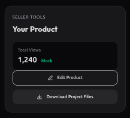

# Future Changes & Minor Bugs

## Seller Tools / Product View Refinements

### Thoughts & Observations
- **Edit Product Button**: Looks weird, not sitting properly in the layout. Needs better positioning/sizing.
- **Download Button**: Currently opens the Supabase file URL in the browser.
    - *Problem*: Doesn't force a download to the PC.
    - *Goal*: Implement a "Force Download" behavior for a more premium experience.
    - *Technical Solution*: Implement a Next.js proxy route to fetch the file and set the `Content-Disposition: attachment` header, or update Supabase Storage metadata to enforce `attachment`.
- **Copy/Naming**:
    - "Seller Tools" and "Your Product" headers feel generic. Need better, more professional naming.
    - "Seller Tools" area needs a better conceptual name for the entire section.
- **Layout Logic**:
    - "Total Views" should probably be part of the main `Product View` area.
    - *Challenge*: Removing it leaves the "Seller Tools" sidebar vacant. Need to identify higher-value seller actions or stats to fill this space.
- **Overall**: The "Seller Tools" area needs a functional and aesthetic overhaul to feel integrated and "premium".
