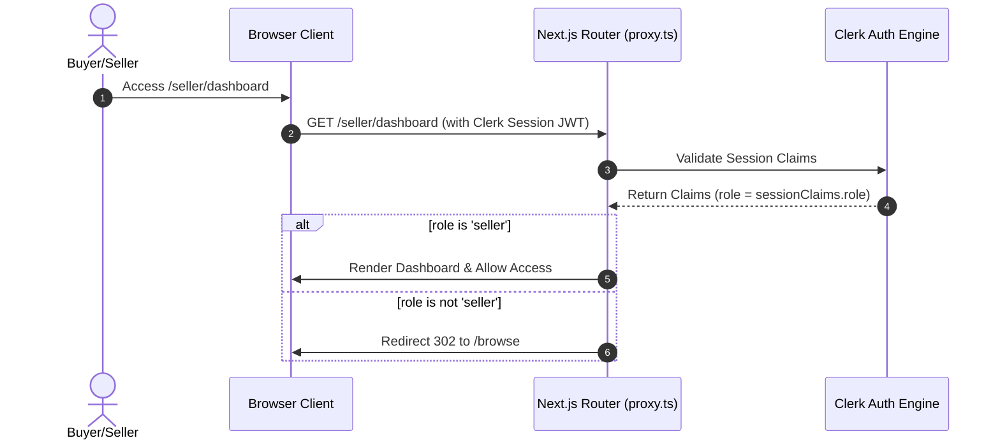
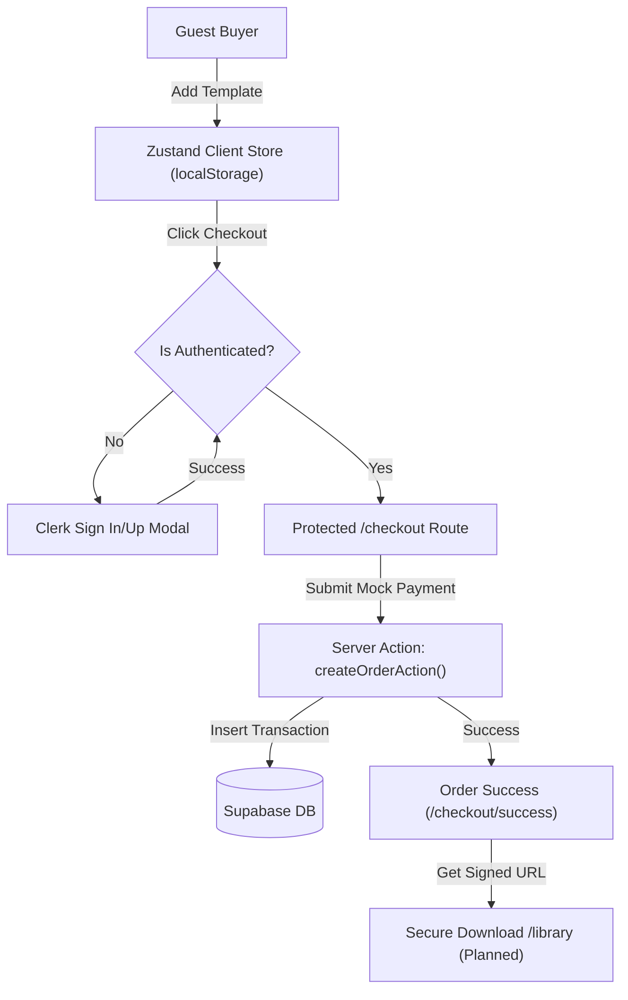

# Tempire — Premium Digital Creator Marketplace

> **"Build your empire one template at a time."**

[](https://nextjs.org/)
[](https://react.dev/)
[](https://tailwindcss.com/)
[](https://supabase.com/)
[](https://clerk.com/)
[](#)

Welcome to **Tempire**, a digital creator marketplace designed for buying, selling, and managing premium digital assets (AI prompts, Notion templates, Figma UI kits, ebooks, etc.). 

> [!NOTE]
> **Project Status:** Tempire was built as a high-fidelity portfolio piece with the intention of transitioning it into a SaaS application. Due to a pursuit of technical perfection and early development learnings, the project is currently paused. It stands as an engineering showcase demonstrating role-based access control, secure server-side workflows, and custom authentication architectures.

---

## Table of Contents
1. [Core Domain Model & Glossary](#core-domain-model--glossary)
2. [Architectural Decisions (ADRs)](#architectural-decisions-adrs)
3. [Architecture Visualizations](#architecture-visualizations)
4. [Key Walkthroughs & Flows](#key-walkthroughs--flows)
5. [Tech Stack & Rationale](#tech-stack--rationale)
6. [Installation & Local Setup](#installation--local-setup)
7. [Environment Configuration](#environment-configuration)
8. [Roadmap](#roadmap)
9. [License](#license)

---

## Core Domain Model & Glossary

Tempire is built around a clear, template-centric domain model:

*   **User (Profile):** An identity managed by Clerk and mirrored in the Supabase database `profiles` table. Users can operate under two roles:
    *   **Buyer:** Default role. Can browse, filter, search, maintain a wishlist, add items to a cart, and purchase templates.
    *   **Seller:** Authorized role. Can upload, manage, edit, publish, and delete digital products, and view basic analytics.
*   **Product (Digital Asset):** The core commodity (e.g., Figma UI Kit, Notion template). Key fields:
    *   `price`: Stored in cents (integer) to prevent floating-point calculation errors.
    *   `status`: Can be `Draft` (requires only a title) or `Published` (requires full metadata and asset uploads).
    *   `image_url`: Located in a public Supabase Storage bucket (`product-images`).
    *   `file_url`: Located in a private Supabase Storage bucket (`product-files`), accessible only via signed URLs.
*   **Cart:** A client-side store containing desired templates. Because products are digital assets, the cart enforces unique/idempotent selections (a user cannot purchase multiple copies of the same template).
*   **Order / Order Item:** The record of purchase. Tracks the buyer, total amount, and references the exact digital items purchased.
*   **Library:** The post-purchase archive where buyers securely access their purchased assets.

---

## Architectural Decisions (ADRs)

### ADR 1: Server-Side Only Supabase Operations
*   **Decision:** All Supabase database queries, file uploads, and state changes are executed strictly on the server (via Next.js Server Components, Server Actions, or Route Handlers).
*   **Rationale:** Prevents exposing Supabase client keys or service roles to the client browser, mitigating security vectors and keeping data fetching closer to the database.

### ADR 2: JWT-Based Role Synchronization
*   **Decision:** Rely on a Custom Session Token template in Clerk containing the claim `"role": "{{user.public_metadata.role}}"` to instantly propagate roles to the client and middleware.
*   **Rationale:** Syncing roles via API webhooks on every login suffered from caching delays and race conditions. Embedding roles directly in the JWT guarantees instant access in `proxy.ts` middleware, achieving zero-layout-flash route guards.

### ADR 3: Client-Side Persistent Cart for Guest Checkout
*   **Decision:** Manage the shopping cart using a client-side Zustand store persisted to `localStorage`.
*   **Rationale:** Allows guest buyers to build their cart without friction or authentication gates. Auth is only requested at the checkout boundary, where the session is validated and converted into a permanent order.

---

## Architecture Visualizations

### 1. Auth & Role-Based Access Control Flow (RBAC)

This sequence diagram illustrates how `proxy.ts` uses the custom Clerk session JWT to restrict access to seller dashboards:



### 2. Purchase & Fulfillment Lifecycle

This flowchart tracks the transition from a guest adding an item to the cart to the final purchase:



---

## Key Walkthroughs & Flows

### 1. The Creator Upload Lifecycle
Sellers can create products in two stages:
*   **Drafts:** Require only a title (minimum 3 characters). Allows creators to save progress without uploading images or zip files.
*   **Published Products:** Require a full description, price, category, cover image, and digital template file. These fields are strictly validated using **Zod** schemas before being published to the public marketplace.

### 2. Onboarding Flow
When an authenticated user attempts to access `/seller/dashboard` without the `seller` role, the `proxy.ts` middleware redirects them to `/seller/onboard`. Here, the user submits a profile bio and category preference. The server action updates Clerk's `publicMetadata` and Supabase's `profiles` tables, forces a `user.reload()` on the client to refresh the JWT claims, and routes them to the dashboard.

### 3. Guest Cart Interaction
Guests can add templates to their cart while browsing. The cart badge and Popover dropdown render dynamically using client hydration guards, preventing layout mismatch warnings. If a user is unauthenticated, clicking "Checkout" opens Clerk's authentication panel, resuming the checkout flow seamlessly upon sign-in.

---

## Tech Stack & Rationale

*   **Next.js 16 (App Router) & React 19:** Utilized for Server Components, metadata generation, dynamic routes, and fast server-side rendering.
*   **Tailwind CSS v4:** For a modern utility-first CSS environment, utilizing custom gradients and dark mode variables.
*   **Clerk Auth:** Handles social logins, secure sessions, and custom JWT session claims to manage buyer vs. seller routing.
*   **Supabase Database & SSR Client:** Powers server-side CRUD operations and enforces Row Level Security (RLS) on Postgres tables.
*   **Supabase Storage:** Implements separate public (`product-images`) and private (`product-files`) buckets to secure assets.
*   **Zustand:** Standardized, lightweight client-side state manager for persistent cart data.
*   **Zod:** Robust schema validation for forms (Uploads, Onboarding, Checkout).

---

## Installation & Local Setup

### Prerequisites
*   Node.js (v18.x or v20.x+)
*   npm or yarn
*   A Clerk account (configured with a Custom Session Token)
*   A Supabase project (configured with RLS schemas and Storage Buckets)

### Setup Steps
1.  **Clone the Repository:**
    ```bash
    git clone https://github.com/your-username/tempire.git
    cd tempire
    ```
2.  **Install Dependencies:**
    ```bash
    npm install
    ```
3.  **Run Migrations:**
    Execute the SQL scripts located in [supabase/migrations](file:///home/redmane/Documents/Port%20Sites/Category%204/Tempire/supabase/migrations/) inside your Supabase SQL Editor to set up the necessary tables, triggers, and RLS policies.
4.  **Launch the Development Server:**
    Next.js Turbopack is disabled in development to maintain styling and Webpack compiler stability. Launch with:
    ```bash
    npm run dev
    ```

---

## Environment Configuration

Create a `.env` file in the root directory and add the following keys:

```env
# Supabase Configuration
NEXT_PUBLIC_SUPABASE_URL=your-supabase-url
NEXT_PUBLIC_SUPABASE_ANON_KEY=your-supabase-anon-key
SUPABASE_SERVICE_ROLE_KEY=your-supabase-service-role-key

# Clerk Authentication Configuration
NEXT_PUBLIC_CLERK_PUBLISHABLE_KEY=your-clerk-publishable-key
CLERK_SECRET_KEY=your-clerk-secret-key
```

### Clerk JWT Claim Setup
To ensure middleware role propagation works, go to the **Clerk Dashboard** -> **Sessions** -> **Customize Session Token** (JWT Template) and add the `role` property:

```json
{
    "role": "{{user.public_metadata.role}}"
}
```

---

## Roadmap

*   **Phase 4: Fulfillment & Post-Purchase UX**
    *   Implement Supabase Signed URLs for secure file access.
    *   Build the `/library` buyer dashboard.
    *   Transition wishlist from local state to Supabase storage.
*   **Phase 5: Search & Discoverability**
    *   Optimize sitemaps and dynamic SEO tags.
    *   Review Core Web Vitals and Lighthouse metrics.
*   **Phase 6: Real Monetization**
    *   Integrate Stripe Checkout and secure serverless webhooks.
*   **Phase 7: Production Hardening**
    *   Run comprehensive security audits on RLS policies and lock down remaining routes.

---

## License

This project is open-source and intended solely for educational and portfolio demonstration purposes. All rights reserved.
